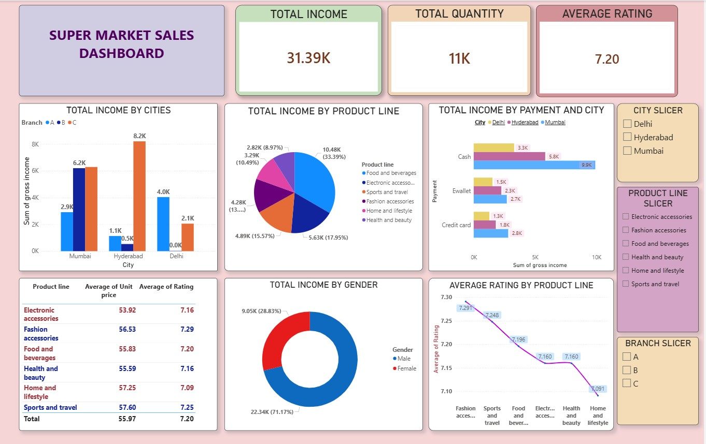

# Realmart Supermarket Sales Analysis Dashboard

## Project Overview
This project focuses on analyzing supermarket sales data for Realmart to generate business insights that support expansion decisions.

The objective was to build an interactive Power BI dashboard to analyze sales performance, customer behavior, product trends, and revenue patterns across different branches.

## Tools & Skills Used
- Power BI
- Data Analytics Foundation
- Data Visualization
- Business Intelligence

## Dashboard Features
- Total Income and Quantity Analysis
- Average Customer Rating Analysis
- City-wise Sales Performance
- Product Line Revenue Analysis
- Payment Method Analysis
- Gender-based Sales Insights
- Product Rating and Pricing Analysis

## Key Metrics
- Total Income: 31.39K
- Total Quantity Sold: 11K
- Average Rating: 7.20

## Dashboard Preview

## Project Outcome
The dashboard provides actionable insights that can help Realmart understand sales trends and make data-driven decisions for opening a new supermarket branch.
